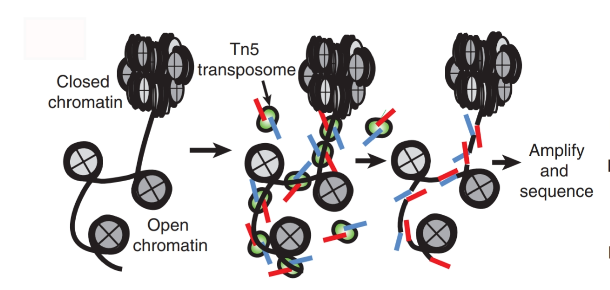

```{css, echo=FALSE}
pre code {
white-space: pre !important;
overflow-x: scroll !important;
word-break: keep-all !important;
word-wrap: initial !important;
}
```

<!--
- Compile from command-line
Rscript -e "rmarkdown::render('systemPipeATACseq.Rmd', c('BiocStyle::html_document'), clean=F); knitr::knit('systemPipeATACseq.Rmd', tangle=TRUE)"; Rscript -e "rmarkdown::render('systemPipeATACseq.Rmd', c('BiocStyle::pdf_document'))"
-->

```{r style, echo = FALSE, results = 'asis'}
BiocStyle::markdown()
options(width=60, max.print=1000)
knitr::opts_chunk$set(
    eval=as.logical(Sys.getenv("KNITR_EVAL", "TRUE")),
    cache=as.logical(Sys.getenv("KNITR_CACHE", "TRUE")), 
    tidy.opts=list(width.cutoff=60), tidy=TRUE)
```

```{r setup, echo=FALSE, message=FALSE, wwarning=FALSE, eval=FALSE}
suppressPackageStartupMessages({
  
})
```

# Introduction

> Users want to provide here background information about the design of their ATAC-Seq project.

**ATAC-seq** (**A**ssay for **T**ransposase-**A**ccessible **C**hromatin with high-throughput **seq**uencing) is a method to investigate the chromatin accessibility at a genome-wide level.

```{r introFigure, include=TRUE, fig.align="center", fig.cap=fig1, echo=FALSE}
fig1 <- "ATAC-seq schematic methodology to chromatin accessibility using the Tn5 transposase.
         In the open chromatin (line between nucleosomes in gray), Tn5 transposase (green) cuts          the regions and insert the adaptors (red and blue) to generate sequencing-library
        fragments. [@Buenrostro2013]"

```

`systemPipeATACseq` pipeline will provide the steps to perform an ATAC-seq analysis. The pipeline show alternatives to trim adapters, check raw sequence read quality, alignment to the reference genome, call peaks, and visualization report.

# Samples and environment settings

## Required packages and resources

To go through this tutorial, you need the following software installed:

* R/>=4.0.3
* systemPipeR R package (version 1.24)
* bwa/0.7.17

The `systemPipeR` package [@H_Backman2016-bt] needs to be loaded to perform the analysis.

```{r library, eval=TRUE}
library(systemPipeR)
```

If you desire to build your pipeline with any different software, make sure to have the respective software installed and configured in your `PATH.` To make sure if the configuration is right, you always can test as follow:

```{r tryCommandline, eval=FALSE}
tryCL(command = "bwa")
```

## Structure of *`targets`* file

The *`targets`* file defines all input files (*e.g.* FASTQ, BAM, BCF) and sample
comparisons of an analysis workflow. The following shows the format of a sample
*`targets`* file included in the package. It also can be viewed and downloaded
from *`systemPipeR`*’s GitHub repository [here](https://github.com/tgirke/systemPipeR/blob/master/inst/extdata/targets.txt).
In a target file with a single type of input files, here FASTQ files of single-end (SE) reads, the first three columns are mandatory including their column
names, while it is four mandatory columns for FASTQ files of PE reads. All
subsequent columns are optional and any number of additional columns can be added as needed.

Users should note here, the usage of targets files is optional when using
*systemPipeR’s* new CWL interface. They can be replaced by a standard YAML
input file used by CWL. Since for organizing experimental variables targets
files are extremely useful and user-friendly. Thus, we encourage users to keep using
them.

### Structure of *`targets`* file for single-end (SE) samples

``` r
targetspath <- system.file("extdata", "targets.txt", package = "systemPipeR")
read.delim(targetspath, comment.char = "#")[1:4, ]
```

To work with custom data, users need to generate a *`targets`* file containing
the paths to their own FASTQ files and then provide under *`targetspath`* the
path to the corresponding *`targets`* file.

# Quality control 

## Read Preprocessing

### Preprocessing with _`preprocessReads`_ function

The function _`preprocessReads`_ allows to apply predefined or custom
read preprocessing functions to all FASTQ files referenced in a
_`SYSargs2`_ container, such as quality filtering or adaptor trimming
routines. The paths to the resulting output FASTQ files are stored in the
_`output`_ slot of the _`SYSargs2`_ object. Internally,
_`preprocessReads`_ uses the _`FastqStreamer`_ function from
the _`ShortRead`_ package to stream through large FASTQ files in a
memory-efficient manner. The following example performs adaptor trimming with
the _`trimLRPatterns`_ function from the _`Biostrings`_ package.
After the trimming step a new targets file is generated (here
_`targets_trimPE.txt`_) containing the paths to the trimmed FASTQ files.
The new targets file can be used for the next workflow step with an updated
_`SYSargs2`_ instance, _e.g._ running the NGS alignments with the
trimmed FASTQ files.

Construct _`SYSargs2`_ object from _`cwl`_ and _`yml`_ param and _`targets`_ files.

```{r construct_SYSargs2_trim-se, echo = FALSE, eval=FALSE}
targets <- system.file("extdata", "targets.txt", package="systemPipeR")
dir_path <- system.file("extdata/cwl/preprocessReads/trim-se", package="systemPipeR")
trim <- loadWorkflow(targets=targets, wf_file="trim-se.cwl", input_file="trim-se.yml", dir_path=dir_path)
trim <- renderWF(trim, inputvars=c(FileName="_FASTQ_PATH1_", SampleName="_SampleName_"))
trim
```

```{r construct_SYSargs2_trim-pe, eval=FALSE}
targetsPE <- system.file("extdata", "targetsPE.txt", package="systemPipeR")
dir_path <- system.file("extdata/cwl/preprocessReads/trim-pe", package="systemPipeR")
trim <- loadWorkflow(targets=targetsPE, wf_file="trim-pe.cwl", input_file="trim-pe.yml", dir_path=dir_path)
trim <- renderWF(trim, inputvars=c(FileName1="_FASTQ_PATH1_", FileName2="_FASTQ_PATH2_", SampleName="_SampleName_"))
trim
output(trim)[1:2]
```

```{r preprocessing, eval=FALSE}
preprocessReads(args=trim, Fct="trimLRPatterns(Rpattern='GCCCGGGTAA', 
                subject=fq)", batchsize=100000, overwrite=TRUE, compress=TRUE)
```

The following example shows how one can design a custom read preprocessing function 
using utilities provided by the _`ShortRead`_ package, and then run it
in batch mode with the _'preprocessReads'_ function (here on paired-end reads).

```{r custom_preprocessing, eval=FALSE}
filterFct <- function(fq, cutoff=20, Nexceptions=0) {
    qcount <- rowSums(as(quality(fq), "matrix") <= cutoff, na.rm=TRUE)
    # Retains reads where Phred scores are >= cutoff with N exceptions
    fq[qcount <= Nexceptions] 
}
preprocessReads(args=trim, Fct="filterFct(fq, cutoff=20, Nexceptions=0)", 
                batchsize=100000)
```

### Preprocessing with TrimGalore!

[TrimGalore!](http://www.bioinformatics.babraham.ac.uk/projects/trim_galore/) is 
a wrapper tool to consistently apply quality and adapter trimming to fastq files, 
with some extra functionality for removing Reduced Representation Bisulfite-Seq 
(RRBS) libraries. 

```{r trimGalore, eval=FALSE}
targets <- system.file("extdata", "targets.txt", package="systemPipeR")
dir_path <- system.file("extdata/cwl/trim_galore/trim_galore-se", package="systemPipeR")
trimG <- loadWorkflow(targets=targets, wf_file="trim_galore-se.cwl", input_file="trim_galore-se.yml", dir_path=dir_path)
trimG <- renderWF(trimG, inputvars=c(FileName="_FASTQ_PATH1_", SampleName="_SampleName_"))
trimG
cmdlist(trimG)[1:2]
output(trimG)[1:2]
## Run Single Machine Option
trimG <- runCommandline(trimG[1], make_bam = FALSE)
```

### Preprocessing with Trimmomatic

```{r trimmomatic, eval=FALSE}
targetsPE <- system.file("extdata", "targetsPE.txt", package="systemPipeR")
dir_path <- system.file("extdata/cwl/trimmomatic/trimmomatic-pe", package="systemPipeR")
trimM <- loadWorkflow(targets=targetsPE, wf_file="trimmomatic-pe.cwl", input_file="trimmomatic-pe.yml", dir_path=dir_path)
trimM <- renderWF(trimM, inputvars=c(FileName1="_FASTQ_PATH1_", FileName2="_FASTQ_PATH2_", SampleName="_SampleName_"))
trimM
cmdlist(trimM)[1:2]
output(trimM)[1:2]
## Run Single Machine Option
trimM <- runCommandline(trimM[1], make_bam = FALSE)
```

## FASTQ quality report

The following _`seeFastq`_ and _`seeFastqPlot`_ functions generate and plot a series of
useful quality statistics for a set of FASTQ files including per cycle quality
box plots, base proportions, base-level quality trends, relative k-mer
diversity, length and occurrence distribution of reads, number of reads above
quality cutoffs and mean quality distribution.  
The function _`seeFastq`_ computes the quality statistics and stores the results in a
relatively small list object that can be saved to disk with _`save()`_ and
reloaded with _`load()`_ for later plotting. The argument _`klength`_ specifies the
k-mer length and _`batchsize`_ the number of reads to a random sample from each
FASTQ file.

```{r fastq_quality, eval=FALSE}
fqlist <- seeFastq(fastq=infile1(trim), batchsize=10000, klength=8)
pdf("./results/fastqReport.pdf", height=18, width=4*length(fqlist))
seeFastqPlot(fqlist)
dev.off()
```

<center></center>
<div align="center">**Figure 5:** FASTQ quality report </div></br>

Parallelization of FASTQ quality report on a single machine with multiple cores.

```{r fastq_quality_parallel_single, eval=FALSE}
f <- function(x) seeFastq(fastq=infile1(trim)[x], batchsize=100000, klength=8)
fqlist <- bplapply(seq(along=trim), f, BPPARAM = MulticoreParam(workers=4))
seeFastqPlot(unlist(fqlist, recursive=FALSE))
```

Parallelization of FASTQ quality report via scheduler (_e.g._ Slurm) across several compute nodes.

```{r fastq_quality_parallel_cluster, eval=FALSE}
library(BiocParallel); library(batchtools)
f <- function(x) {
  library(systemPipeR)
  targetsPE <- system.file("extdata", "targetsPE.txt", package="systemPipeR")
  dir_path <- system.file("extdata/cwl/preprocessReads/trim-pe", package="systemPipeR")
  trim <- loadWorkflow(targets=targetsPE, wf_file="trim-pe.cwl", input_file="trim-pe.yml", dir_path=dir_path)
  trim <- renderWF(trim, inputvars=c(FileName1="_FASTQ_PATH1_", FileName2="_FASTQ_PATH2_", SampleName="_SampleName_"))
  seeFastq(fastq=infile1(trim)[x], batchsize=100000, klength=8)
}
resources <- list(walltime=120, ntasks=1, ncpus=4, memory=1024) 
param <- BatchtoolsParam(workers = 4, cluster = "slurm", template = "batchtools.slurm.tmpl", resources = resources)
fqlist <- bplapply(seq(along=trim), f, BPPARAM = param)
seeFastqPlot(unlist(fqlist, recursive=FALSE))
```

## NGS Alignment software

After quality control, the sequence reads can be aligned to a reference genome or 
transcriptome database. The following sessions present some NGS sequence alignment 
software. Select the most accurate aligner and determining the optimal parameter 
for your custom data set project.

For all the following examples, it is necessary to install the respective software 
and export the `PATH` accordingly. If it is available [Environment Module](http://modules.sourceforge.net/) 
in the system, you can load all the request software with _`moduleload(args)`_ function.

### Alignment with _`BWA-MEM`_ (_e.g._ for VAR-Seq)

The following example runs BWA-MEM as a single process without submitting it to a cluster. ##TODO: add reference

Build the index:

```{r bwa_index, eval=FALSE}
dir_path <- system.file("extdata/cwl/bwa/bwa-idx", package="systemPipeR")
idx <- loadWorkflow(targets=NULL, wf_file="bwa-index.cwl", input_file="bwa-index.yml", dir_path=dir_path)
idx <- renderWF(idx)
idx
cmdlist(idx) # Indexes reference genome

## Run 
runCommandline(idx, make_bam = FALSE)
```

Running the alignment:

```{r bwa-pe_alignment, eval=FALSE}    
targetsPE <- system.file("extdata", "targetsPE.txt", package = "systemPipeR")
dir_path <- system.file("extdata/cwl/bwa/bwa-pe", package="systemPipeR")
bwaPE <- loadWorkflow(targets = targetsPE, wf_file = "bwa-pe.cwl", 
    input_file = "bwa-pe.yml", dir_path = dir_path)
bwaPE <- renderWF(bwaPE, inputvars = c(FileName1 = "_FASTQ_PATH1_", FileName2 = "_FASTQ_PATH2_", 
    SampleName = "_SampleName_"))
bwaPE
cmdlist(bwaPE)[1:2]
output(bwaPE)[1:2]
## Single Machine
bwaPE <- runCommandline(args= bwaPE, make_bam=FALSE) 

## Cluster
library(batchtools)
resources <- list(walltime = 120, ntasks = 1, ncpus = 4, memory = 1024)
reg <- clusterRun(bwaPE, FUN = runCommandline, more.args = list(args=bwaPE, dir = FALSE), 
    conffile = ".batchtools.conf.R", template = "batchtools.slurm.tmpl", 
    Njobs = 18, runid = "01", resourceList = resources)
getStatus(reg = reg)
```

Create new targets file.

```{r writeTargetsout_bwaPE, eval=FALSE}
names(clt(bwaPE))
writeTargetsout(x=bwaPE, file="default", step = 1, 
                new_col = "bwaPE", new_col_output_index = 1, overwrite = TRUE)
```


# Version Information

```{r sessionInfo}
sessionInfo()
```

# Funding

This project was supported by funds from the National Institutes of
Health (NIH) and the National Science Foundation (NSF).

# References

