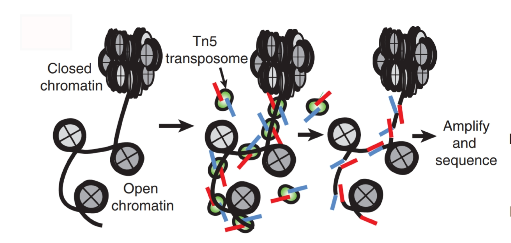
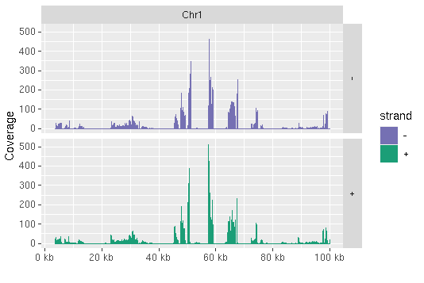
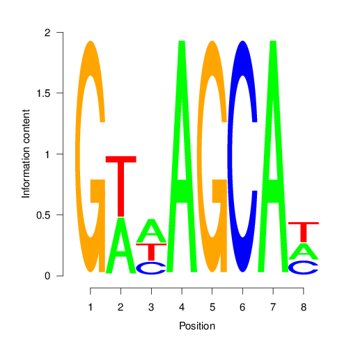

```{css, echo=FALSE}
pre code {
white-space: pre !important;
overflow-x: scroll !important;
word-break: keep-all !important;
word-wrap: initial !important;
}
```

<!--
- Compile from command-line
Rscript -e "rmarkdown::render('SPatacseq.Rmd', c('BiocStyle::html_document'), clean=F); knitr::knit('SPatacseq.Rmd', tangle=TRUE)"; Rscript -e "rmarkdown::render('SPatacseq.Rmd', c('BiocStyle::pdf_document'))"
-->

```{r style, echo = FALSE, results = 'asis'}
BiocStyle::markdown()
options(width=60, max.print=1000)
knitr::opts_chunk$set(
    eval=as.logical(Sys.getenv("KNITR_EVAL", "TRUE")),
    cache=as.logical(Sys.getenv("KNITR_CACHE", "TRUE")), 
    tidy.opts=list(width.cutoff=60), tidy=TRUE)
```

```{r setup, echo=FALSE, message=FALSE, wwarning=FALSE, eval=TRUE}
suppressPackageStartupMessages({
  library(systemPipeR)
  
})
```

# Introduction

> Users want to provide here background information about the design of their ATAC-Seq project.

**ATAC-seq** (**A**ssay for **T**ransposase-**A**ccessible **C**hromatin with high-throughput **seq**uencing) is a method to investigate the chromatin accessibility at a genome-wide level.

```{r introFigure, include=TRUE, fig.align="center", fig.cap=fig1, echo=FALSE}
fig1 <- "ATAC-seq schematic methodology to chromatin accessibility using the Tn5 transposase.
         In the open chromatin (line between nucleosomes in gray), Tn5 transposase (green) cuts          the regions and insert the adaptors (red and blue) to generate sequencing-library
        fragments. [@Buenrostro2013-ap]"

```

`SPatacseq` pipeline will provide the steps to perform an ATAC-seq analysis. The pipeline show alternatives to trim adapters, check raw sequence read quality, alignment to the reference genome, call peaks, and visualization report.

# Samples and environment settings

## Required packages and resources

To go through this tutorial, you need the following software installed:

* R/>=4.0.3
* systemPipeR R package (version 1.24)
* bwa/0.7.17

The `systemPipeR` package [@H_Backman2016-bt] needs to be loaded to perform the analysis.

```{r library, eval=TRUE, message=FALSE, wwarning=FALSE}
library(systemPipeR)
```

If you desire to build your pipeline with any different software, make sure to have the respective software installed and configured in your `PATH.` To make sure if the configuration is right, you always can test as follow:

```{r tryCommandline, eval=FALSE}
tryCL(command = "bwa")
```

## Structure of *`targets`* file

The *`targets`* file defines all input files (*e.g.* FASTQ, BAM, BCF) and sample
comparisons of an analysis workflow. The following shows the format of a sample
*`targets`* file included in the package. It also can be viewed and downloaded
from *`systemPipeR`*’s GitHub repository [here](https://github.com/tgirke/systemPipeR/blob/master/inst/extdata/targets.txt).
In a target file with a single type of input files, here FASTQ files of single-end (SE) reads, the first three columns are mandatory including their column
names, while it is four mandatory columns for FASTQ files of PE reads. All
subsequent columns are optional and any number of additional columns can be added as needed.

Users should note here, the usage of targets files is optional when using
*systemPipeR’s* new CWL interface. They can be replaced by a standard YAML
input file used by CWL. Since for organizing experimental variables targets
files are extremely useful and user-friendly. Thus, we encourage users to keep using
them.

### Structure of *`targets`* file for single-end (SE) samples

```{r}
targetspath <- system.file("extdata", "targets.txt", package = "systemPipeR")
read.delim(targetspath, comment.char = "#")[1:4, ]
```

To work with custom data, users need to generate a *`targets`* file containing
the paths to their own FASTQ files and then provide under *`targetspath`* the
path to the corresponding *`targets`* file.

# Quality control 

## Read Preprocessing

### Preprocessing with _`preprocessReads`_ function

The function _`preprocessReads`_ allows to apply predefined or custom
read preprocessing functions to all FASTQ files referenced in a
_`SYSargs2`_ container, such as quality filtering or adaptor trimming
routines. The paths to the resulting output FASTQ files are stored in the
_`output`_ slot of the _`SYSargs2`_ object. Internally,
_`preprocessReads`_ uses the _`FastqStreamer`_ function from
the _`ShortRead`_ package to stream through large FASTQ files in a
memory-efficient manner. The following example performs adaptor trimming with
the _`trimLRPatterns`_ function from the _`Biostrings`_ package.
After the trimming step a new targets file is generated (here
_`targets_trimPE.txt`_) containing the paths to the trimmed FASTQ files.
The new targets file can be used for the next workflow step with an updated
_`SYSargs2`_ instance, _e.g._ running the NGS alignments with the
trimmed FASTQ files.

Construct _`SYSargs2`_ object from _`cwl`_ and _`yml`_ param and _`targets`_ files.

```{r construct_SYSargs2_trim-se, echo = FALSE, eval=FALSE}
targets <- system.file("extdata", "targets.txt", package="systemPipeR")
dir_path <- system.file("extdata/cwl/preprocessReads/trim-se", package="systemPipeR")
trim <- loadWorkflow(targets=targets, wf_file="trim-se.cwl", input_file="trim-se.yml", dir_path=dir_path)
trim <- renderWF(trim, inputvars=c(FileName="_FASTQ_PATH1_", SampleName="_SampleName_"))
trim
```

```{r construct_SYSargs2_trim-pe, eval=FALSE}
targetsPE <- system.file("extdata", "targetsPE.txt", package="systemPipeR")
dir_path <- system.file("extdata/cwl/preprocessReads/trim-pe", package="systemPipeR")
trim <- loadWorkflow(targets=targetsPE, wf_file="trim-pe.cwl", input_file="trim-pe.yml", dir_path=dir_path)
trim <- renderWF(trim, inputvars=c(FileName1="_FASTQ_PATH1_", FileName2="_FASTQ_PATH2_", SampleName="_SampleName_"))
trim
output(trim)[1:2]
```

```{r preprocessing, eval=FALSE}
preprocessReads(args=trim, Fct="trimLRPatterns(Rpattern='GCCCGGGTAA', 
                subject=fq)", batchsize=100000, overwrite=TRUE, compress=TRUE)
```

The following example shows how one can design a custom read preprocessing function 
using utilities provided by the _`ShortRead`_ package, and then run it
in batch mode with the _'preprocessReads'_ function (here on paired-end reads).

```{r custom_preprocessing, eval=FALSE}
filterFct <- function(fq, cutoff=20, Nexceptions=0) {
    qcount <- rowSums(as(quality(fq), "matrix") <= cutoff, na.rm=TRUE)
    # Retains reads where Phred scores are >= cutoff with N exceptions
    fq[qcount <= Nexceptions] 
}
preprocessReads(args=trim, Fct="filterFct(fq, cutoff=20, Nexceptions=0)", 
                batchsize=100000)
```

### Preprocessing with TrimGalore!

[TrimGalore!](http://www.bioinformatics.babraham.ac.uk/projects/trim_galore/) is 
a wrapper tool to consistently apply quality and adapter trimming to fastq files, 
with some extra functionality for removing Reduced Representation Bisulfite-Seq 
(RRBS) libraries. 

```{r trimGalore, eval=FALSE}
targets <- system.file("extdata", "targets.txt", package="systemPipeR")
dir_path <- system.file("extdata/cwl/trim_galore/trim_galore-se", package="systemPipeR")
trimG <- loadWorkflow(targets=targets, wf_file="trim_galore-se.cwl", input_file="trim_galore-se.yml", dir_path=dir_path)
trimG <- renderWF(trimG, inputvars=c(FileName="_FASTQ_PATH1_", SampleName="_SampleName_"))
trimG
cmdlist(trimG)[1:2]
output(trimG)[1:2]
## Run Single Machine Option
trimG <- runCommandline(trimG[1], make_bam = FALSE)
```

### Preprocessing with Trimmomatic

```{r trimmomatic, eval=FALSE}
targetsPE <- system.file("extdata", "targetsPE.txt", package="systemPipeR")
dir_path <- system.file("extdata/cwl/trimmomatic/trimmomatic-pe", package="systemPipeR")
trimM <- loadWorkflow(targets=targetsPE, wf_file="trimmomatic-pe.cwl", input_file="trimmomatic-pe.yml", dir_path=dir_path)
trimM <- renderWF(trimM, inputvars=c(FileName1="_FASTQ_PATH1_", FileName2="_FASTQ_PATH2_", SampleName="_SampleName_"))
trimM
cmdlist(trimM)[1:2]
output(trimM)[1:2]
## Run Single Machine Option
trimM <- runCommandline(trimM[1], make_bam = FALSE)
```

## FASTQ quality report

The following _`seeFastq`_ and _`seeFastqPlot`_ functions generate and plot a series of
useful quality statistics for a set of FASTQ files including per cycle quality
box plots, base proportions, base-level quality trends, relative k-mer
diversity, length and occurrence distribution of reads, number of reads above
quality cutoffs and mean quality distribution.  
The function _`seeFastq`_ computes the quality statistics and stores the results in a
relatively small list object that can be saved to disk with _`save()`_ and
reloaded with _`load()`_ for later plotting. The argument _`klength`_ specifies the
k-mer length and _`batchsize`_ the number of reads to a random sample from each
FASTQ file.

```{r fastq_quality, eval=FALSE}
fqlist <- seeFastq(fastq=infile1(trim), batchsize=10000, klength=8)
pdf("./results/fastqReport.pdf", height=18, width=4*length(fqlist))
seeFastqPlot(fqlist)
dev.off()
```

<center></center>
<div align="center">**Figure 5:** FASTQ quality report </div></br>

Parallelization of FASTQ quality report on a single machine with multiple cores.

```{r fastq_quality_parallel_single, eval=FALSE}
f <- function(x) seeFastq(fastq=infile1(trim)[x], batchsize=100000, klength=8)
fqlist <- bplapply(seq(along=trim), f, BPPARAM = MulticoreParam(workers=4))
seeFastqPlot(unlist(fqlist, recursive=FALSE))
```

Parallelization of FASTQ quality report via scheduler (_e.g._ Slurm) across several compute nodes.

```{r fastq_quality_parallel_cluster, eval=FALSE}
library(BiocParallel); library(batchtools)
f <- function(x) {
  library(systemPipeR)
  targetsPE <- system.file("extdata", "targetsPE.txt", package="systemPipeR")
  dir_path <- system.file("extdata/cwl/preprocessReads/trim-pe", package="systemPipeR")
  trim <- loadWorkflow(targets=targetsPE, wf_file="trim-pe.cwl", input_file="trim-pe.yml", dir_path=dir_path)
  trim <- renderWF(trim, inputvars=c(FileName1="_FASTQ_PATH1_", FileName2="_FASTQ_PATH2_", SampleName="_SampleName_"))
  seeFastq(fastq=infile1(trim)[x], batchsize=100000, klength=8)
}
resources <- list(walltime=120, ntasks=1, ncpus=4, memory=1024) 
param <- BatchtoolsParam(workers = 4, cluster = "slurm", template = "batchtools.slurm.tmpl", resources = resources)
fqlist <- bplapply(seq(along=trim), f, BPPARAM = param)
seeFastqPlot(unlist(fqlist, recursive=FALSE))
```

# Read Alignment

After quality control, the sequence reads can be aligned to a reference genome or miRNA database. The following sessions present some NGS sequence alignment software. Select the most accurate aligner and determining the optimal parameter for your custom data set project.

For all the following examples, it is necessary to install the respective software and export the PATH accordingly. If it is available Environment Module in the system, you can load all the request software with `moduleload(modules(idx))` function.

## Alignment with _`Bowtie2`_ 

The following example runs _`Bowtie2`_ as a single process without submitting it to a cluster.

Building the index:

```{r bowtie2_index, eval=FALSE}
dir_path <- system.file("extdata/cwl/bowtie2/bowtie2-idx", package="systemPipeR")
idx <- loadWorkflow(targets=NULL, wf_file="bowtie2-index.cwl", input_file="bowtie2-index.yml", dir_path=dir_path)
idx <- renderWF(idx)
idx
cmdlist(idx)

## Run in single machine
runCommandline(idx, make_bam = FALSE)
```

Building all the command-line:

```{r bowtie2_SYSargs2, eval=FALSE}
targetspath <- system.file("extdata", "targetsPE.txt", package = "systemPipeR")
dir_path <- system.file("extdata/cwl/bowtie2/bowtie2-mi", package = "SPatacseq")
bowtie <- loadWorkflow(targets = targetspath, wf_file = "bowtie2-mapping-mi.cwl", 
    input_file = "bowtie2-mapping-mi.yml", dir_path = dir_path)
bowtie <- renderWF(bowtie, inputvars = c(FileTrim = "_FASTQ_PATH1_", SampleName = "_SampleName_"))
bowtie
cmdlist(bowtie)[1:2]
output(bowtie)[1:2]
```

Please note that each experiment and/or each species may require an optimization 
of the parameters used. Here is an example where no mismatches are allowed, 
and `-k` mode is used. The `-k` represents the maximum number of alignments to
report per read. By default, Bowtie2 reports at most one alignment per read, 
and if multiple equivalent alignments exist, it chooses one randomly.
There is indicative that `Bowtie2` with very sensitive 
local (`--very-sensitive-local`) argument provides better accuracy and generates 
smaller `P-values` for true positives [@Ziemann2016-mp].

Running all the jobs to computing nodes.

```{r bowtie2_cluster, eval=FALSE}
resources <- list(walltime=120, ntasks=1, ncpus=4, memory=1024) 
reg <- clusterRun(bowtie, FUN = runCommandline, more.args = list(args=bowtiePE, dir = FALSE), 
    conffile = ".batchtools.conf.R", template = "batchtools.slurm.tmpl", 
    Njobs = 6, runid = "01", resourceList = resources)
getStatus(reg = reg)
bowtie <- output_update(bowtie, dir = FALSE, replace = TRUE, extension = c(".sam", ".bam"))
```

Alternatively, it possible to run all the jobs in a single machine.

```{r bowtie2_sm, eval=FALSE}
bowtie <- runCommandline(bowtie, make_bam=TRUE)
systemPipeR:::check.output(bowtie)
```

Create new targets file.

```{r writeTargetsout_bowtie, eval=FALSE}
names(clt(bowtie))
writeTargetsout(x=bowtie, file="default", step = 1, 
                new_col = "bowtie", new_col_output_index = 1, overwrite = TRUE)
```

### Read and alignment count stats

Generate a table of read and alignment counts for all samples.

```{r read_stats, eval=FALSE}
read_statsDF <- alignStats(bowtie, subset = "FileTrim")
write.table(read_statsDF, "results/alignStats_bowtie.xls", row.names = FALSE, quote = FALSE, 
    sep = "\t")
```

The following shows the first four lines of the sample alignment stats file provided by the systemPipeR package. 
```{r read_stats_show, eval=TRUE}
table <- system.file("extdata", "alignStats_bowtie.xls", package = "SPmirnaseq")
showDT(read.table(table, header = TRUE))## system
```

### Alignment with _`BWA-MEM`_ (_e.g._ for VAR-Seq)

The following example runs BWA-MEM as a single process without submitting it to a cluster. ##TODO: add reference

Build the index:

```{r bwa_index, eval=FALSE}
dir_path <- system.file("extdata/cwl/bwa/bwa-idx", package="systemPipeR")
idx <- loadWorkflow(targets=NULL, wf_file="bwa-index.cwl", input_file="bwa-index.yml", dir_path=dir_path)
idx <- renderWF(idx)
idx
cmdlist(idx) # Indexes reference genome

## Run 
runCommandline(idx, make_bam = FALSE)
```

Running the alignment:

```{r bwa-pe_alignment, eval=FALSE}    
targetsPE <- system.file("extdata", "targetsPE.txt", package = "systemPipeR")
dir_path <- system.file("extdata/cwl/bwa/bwa-pe", package="systemPipeR")
bwaPE <- loadWorkflow(targets = targetsPE, wf_file = "bwa-pe.cwl", 
    input_file = "bwa-pe.yml", dir_path = dir_path)
bwaPE <- renderWF(bwaPE, inputvars = c(FileName1 = "_FASTQ_PATH1_", FileName2 = "_FASTQ_PATH2_", 
    SampleName = "_SampleName_"))
bwaPE
cmdlist(bwaPE)[1:2]
output(bwaPE)[1:2]
## Single Machine
bwaPE <- runCommandline(args= bwaPE, make_bam=TRUE) 

## Cluster
library(batchtools)
resources <- list(walltime = 120, ntasks = 1, ncpus = 4, memory = 1024)
reg <- clusterRun(bwaPE, FUN = runCommandline, more.args = list(args=bwaPE, dir = FALSE), 
    conffile = ".batchtools.conf.R", template = "batchtools.slurm.tmpl", 
    Njobs = 18, runid = "01", resourceList = resources)
getStatus(reg = reg)
```

Create new targets file.

```{r writeTargetsout_bwaPE, eval=FALSE}
names(clt(bwaPE))
writeTargetsout(x=bwaPE, file="default", step = 1, 
                new_col = "bwaPE", new_col_output_index = 1, overwrite = TRUE)
```

Check whether all BAM files have been created and write out the new targets file. 

```{r check_files_exist, eval=FALSE}
writeTargetsout(x=bwaPE, file="targets_bam.txt", step = 1, 
                new_col = "FileName", new_col_output_index = 1, overwrite = TRUE)
outpaths <- subsetWF(args , slot="output", subset=1, index=1)
file.exists(outpaths)
```

## Create symbolic links for viewing BAM files in IGV

The `symLink2bam` function creates symbolic links to view the BAM alignment files in a
genome browser such as IGV without moving these large files to a local
system. The corresponding URLs are written to a file with a path
specified under `urlfile`, here `IGVurl.txt`. Please replace the directory and the user name. 

```{r symbol_links, eval=FALSE}
symLink2bam(sysargs=args, htmldir=c("~/.html/", "somedir/"), 
            urlbase="http://cluster.hpcc.ucr.edu/~tgirke/", 
            urlfile="./results/IGVurl.txt")
```

# Utilities for coverage data

The following introduces several utilities useful for ChIP-Seq data. They are not part of the actual workflow.

## Rle object stores coverage information

```{r rle_object, eval=FALSE}
library(rtracklayer); library(GenomicRanges)
library(Rsamtools); library(GenomicAlignments)
outpaths <- subsetWF(bwaPE , slot="output", subset=1, index=1)
aligns <- readGAlignments(outpaths[1])
cov <- coverage(aligns)
cov
# RleList of length 7
# $Chr1
# integer-Rle of length 100000 with 11827 runs
#   Lengths: 3644    3    2    3    2    1 ...    1    5   23    3   12
#   Values :    0    1    3    4    5    6 ...   17   19   20   19   18
# 
# $Chr2
# integer-Rle of length 100000 with 5085 runs
#   Lengths:  999    7   11   55    2    5 ...    2    1    1    1 3357
#   Values :    0    2    3    4    3    2 ...    8    6    2    1    0
# 
# $Chr3
# integer-Rle of length 100000 with 12688 runs
#   Lengths: 8953    5    1    2    9    5 ...    3    4    4    1   35
#   Values :    0    1    2    3    4    5 ...   16   15   14    2    0
# 
# $Chr4
# integer-Rle of length 100000 with 5113 runs
#   Lengths: 4104   53  157   71    4   50 ...   43   12   63   12  446
#   Values :    0    1    0    1    2    1 ...    0    1    2    1    0
# 
# $Chr5
# integer-Rle of length 100000 with 6995 runs
#   Lengths: 1236   34    1    2    1    1 ...   13    6    1   55  413
#   Values :    0    1    2    3    4    5 ...    5    4    3    1    0
# 
# ...
# <2 more elements>
```

## Resizing aligned reads

```{r resize_align, eval=FALSE}
trim(resize(as(aligns, "GRanges"), width = 200))
```

## Naive peak calling

```{r rle_slice, eval=FALSE}
islands <- slice(cov, lower = 15)
islands[[1]]
```

## Plot coverage for defined region

```{r plot_coverage, eval=FALSE}
library(ggbio)
myloc <- c("Chr1", 1, 100000)
ga <- readGAlignments(outpaths[1], use.names=TRUE,
                      param=ScanBamParam(which=GRanges(myloc[1], 
                        IRanges(as.numeric(myloc[2]), as.numeric(myloc[3])))))
autoplot(ga, aes(color = strand, fill = strand), facets = strand ~ seqnames, stat = "coverage")
```



# Peak calling with MACS2

## Merge BAM files of replicates prior to peak calling

Merging BAM files of technical and/or biological replicates can improve
the sensitivity of the peak calling by increasing the depth of read
coverage. The `mergeBamByFactor` function merges BAM files based on grouping information
specified by a `factor`, here the `Factor` column of the imported targets file. It 
also returns an updated `SYSargs2` object containing the paths to the
merged BAM files as well as to any unmerged files without replicates.
This step can be skipped if merging of BAM files is not desired.

```{r merge_bams, eval=FALSE}
dir_path <- system.file("extdata/cwl/mergeBamByFactor", package="systemPipeR")
args <- loadWF(targets = "targets_bam.txt", wf_file = "merge-bam.cwl", 
    input_file = "merge-bam.yml", dir_path = dir_path)
args <- renderWF(args, inputvars = c(FileName = "_BAM_PATH_", SampleName = "_SampleName_"))

args_merge <- mergeBamByFactor(args=args, overwrite=TRUE)
writeTargetsout(x=args_merge, file="targets_mergeBamByFactor.txt", step = 1, 
                new_col = "FileName", new_col_output_index = 1, overwrite = TRUE )
```

```{r call_peaks_macs_envVar_settings, eval=FALSE}
# Skip if a module system is not used
module("list")
module("unload", "miniconda2")
module("load", "python/2.7.14") # Make sure to set up your enviroment variable for MACS2 
```

## Peak calling without input/reference sample

MACS2 can perform peak calling on ChIP-Seq data with and without input
samples [@Zhang2008-pc]. The following performs peak calling without
input on all samples specified in the corresponding `args` object. Note, due to
the small size of the sample data, MACS2 needs to be run here with the
`nomodel` setting. For real data sets, users want to remove this parameter 
in the corresponding `*.param` file(s).

```{r call_peaks_macs_noref, eval=FALSE}
dir_path <- system.file("extdata/cwl/MACS2/MACS2-noinput/", package="systemPipeR")
args <- loadWF(targets = "targets_mergeBamByFactor.txt", wf_file = "macs2.cwl", 
    input_file = "macs2.yml", dir_path = dir_path)
args <- renderWF(args, inputvars = c(FileName = "_FASTQ_PATH1_", SampleName = "_SampleName_"))

runCommandline(args, make_bam = FALSE, force=T)
outpaths <- subsetWF(args, slot="output", subset=1, index=1)
file.exists(outpaths)
writeTargetsout(x=args, file="targets_macs.txt", step = 1, 
                new_col = "FileName", new_col_output_index = 1, overwrite = TRUE )
```

## Peak calling with input/reference sample

To perform peak calling with input samples, they can be most
conveniently specified in the `SampleReference` column of the initial
`targets` file. The `writeTargetsRef` function uses this information to create a `targets` 
file intermediate for running MACS2 with the corresponding input samples.

```{r call_peaks_macs_withref, eval=FALSE}
writeTargetsRef(infile="targets_mergeBamByFactor.txt", 
                outfile="targets_bam_ref.txt", silent=FALSE, overwrite=TRUE)
dir_path <- system.file("extdata/cwl/MACS2/MACS2-input/", package="systemPipeR")
args_input <- loadWF(targets = "targets_bam_ref.txt", wf_file = "macs2-input.cwl", 
    input_file = "macs2.yml", dir_path = dir_path)
args_input <- renderWF(args_input, inputvars = c(FileName1 = "_FASTQ_PATH1_", FileName2 = "_FASTQ_PATH2_", SampleName = "_SampleName_"))
cmdlist(args_input)[1]
## Run
args_input <- runCommandline(args_input, make_bam = FALSE, force=T)
outpaths_input <- subsetWF(args_input , slot="output", subset=1, index=1)
file.exists(outpaths_input)
writeTargetsout(x=args_input, file="targets_macs_input.txt", step = 1, 
                new_col = "FileName", new_col_output_index = 1, overwrite = TRUE )
```

The peak calling results from MACS2 are written for each sample to
separate files in the `results` directory. They are named after the corresponding
files with extensions used by MACS2.

## Identify consensus peaks

The following example shows how one can identify consensus preaks among two peak sets sharing either a minimum absolute overlap and/or minimum relative overlap using the `subsetByOverlaps` or `olRanges` functions, respectively. Note, the latter is a custom function imported below by sourcing it.

```{r consensus_peaks, eval=FALSE}
# source("http://faculty.ucr.edu/~tgirke/Documents/R_BioCond/My_R_Scripts/rangeoverlapper.R")
outpaths <- subsetWF(args , slot="output", subset=1, index=1) ## escolher um dos outputs index
peak_M1A <- outpaths["M1A"]
peak_M1A <- as(read.delim(peak_M1A, comment="#")[,1:3], "GRanges")
peak_A1A <- outpaths["A1A"]
peak_A1A <- as(read.delim(peak_A1A, comment="#")[,1:3], "GRanges")
(myol1 <- subsetByOverlaps(peak_M1A, peak_A1A, minoverlap=1)) 
            # Returns any overlap
myol2 <- olRanges(query=peak_M1A, subject=peak_A1A, output="gr") 
            # Returns any overlap with OL length information
myol2[values(myol2)["OLpercQ"][,1]>=50] 
            # Returns only query peaks with a minimum overlap of 50%
```

# Annotate peaks with genomic context

## Annotation with `ChIPpeakAnno` package

The following annotates the identified peaks with genomic context information using the `ChIPpeakAnno` and `ChIPseeker` packages, respectively [@Zhu2010-zo; @Yu2015-xu].

```{r chip_peak_anno, eval=FALSE}
library(ChIPpeakAnno); library(GenomicFeatures)
dir_path <- system.file("extdata/cwl/annotate_peaks", package="systemPipeR")
args <- loadWF(targets = "targets_macs.txt", wf_file = "annotate-peaks.cwl", 
    input_file = "annotate-peaks.yml", dir_path = dir_path)
args <- renderWF(args, inputvars = c(FileName = "_FASTQ_PATH1_", SampleName = "_SampleName_"))

txdb <- makeTxDbFromGFF(file="data/tair10.gff", format="gff", dataSource="TAIR", 
                        organism="Arabidopsis thaliana")
ge <- genes(txdb, columns=c("tx_name", "gene_id", "tx_type")) 
for(i in seq(along=args)) {
    peaksGR <- as(read.delim(infile1(args)[i], comment="#"), "GRanges")
    annotatedPeak <- annotatePeakInBatch(peaksGR, AnnotationData=genes(txdb))
    df <- data.frame(as.data.frame(annotatedPeak), 
                     as.data.frame(values(ge[values(annotatedPeak)$feature,])))
    outpaths <- subsetWF(args , slot="output", subset=1, index=1)
    write.table(df, outpaths[i], quote=FALSE, row.names=FALSE, sep="\t")
}
writeTargetsout(x=args, file="targets_peakanno.txt", step = 1, 
                new_col = "FileName", new_col_output_index = 1, overwrite = TRUE )
```

```{r chip_peak_anno_full_annotation, include=FALSE, eval=FALSE}
## Perform previous step with full genome annotation from Biomart
# txdb <- makeTxDbFromBiomart(biomart = "plants_mart", dataset = "athaliana_eg_gene", host="plants.ensembl.org")
# tx <- transcripts(txdb, columns=c("tx_name", "gene_id", "tx_type"))
# ge <- genes(txdb, columns=c("tx_name", "gene_id", "tx_type")) # works as well
# seqlevels(ge) <- c("Chr1", "Chr2", "Chr3", "Chr4", "Chr5", "ChrC", "ChrM")
# table(mcols(tx)$tx_type)
# tx <- tx[!duplicated(unstrsplit(values(tx)$gene_id, sep=","))] # Keeps only first transcript model for each gene]
# annotatedPeak <- annotatePeakInBatch(peaksGR, AnnotationData = tx)
```

The peak annotation results are written for each peak set to separate
files in the `results` directory. They are named after the corresponding peak
files with extensions specified in the `annotate_peaks.param` file, 
here `*.peaks.annotated.xls`.

## Annotation with `ChIPseeker` package

Same as in previous step but using the `ChIPseeker` package for annotating the peaks.

```{r chip_peak_seeker, eval=FALSE}
library(ChIPseeker)
for(i in seq(along=args)) {
    peakAnno <- annotatePeak(infile1(args)[i], TxDb=txdb, verbose=FALSE)
    df <- as.data.frame(peakAnno)
    outpaths <- subsetWF(args , slot="output", subset=1, index=1)
    write.table(df, outpaths[i], quote=FALSE, row.names=FALSE, sep="\t")
}
writeTargetsout(x=args, file="targets_peakanno.txt", step = 1, 
                new_col = "FileName", new_col_output_index = 1, overwrite = TRUE )
```

Summary plots provided by the `ChIPseeker` package. Here applied only to one sample
for demonstration purposes.

```{r chip_peak_seeker_plots, eval=FALSE}
peak <- readPeakFile(infile1(args)[1])
covplot(peak, weightCol="X.log10.pvalue.")
outpaths <- subsetWF(args , slot="output", subset=1, index=1)
peakHeatmap(outpaths[1], TxDb=txdb, upstream=1000, downstream=1000, 
            color="red")
plotAvgProf2(outpaths[1], TxDb=txdb, upstream=1000, downstream=1000, 
             xlab="Genomic Region (5'->3')", ylab = "Read Count Frequency")
```

# Count reads overlapping peaks

The `countRangeset` function is a convenience wrapper to perform read counting
iteratively over serveral range sets, here peak range sets. Internally,
the read counting is performed with the `summarizeOverlaps` function from the 
`GenomicAlignments` package. The resulting count tables are directly saved to 
files, one for each peak set.

```{r count_peak_ranges, eval=FALSE}
library(GenomicRanges)
dir_path <- system.file("extdata/cwl/count_rangesets", package="systemPipeR")
args <- loadWF(targets = "targets_macs.txt", wf_file = "count_rangesets.cwl", 
    input_file = "count_rangesets.yml", dir_path = dir_path)
args <- renderWF(args, inputvars = c(FileName = "_FASTQ_PATH1_", SampleName = "_SampleName_"))

## Bam Files
targets <- system.file("extdata", "targetsPE_chip.txt", package="systemPipeR")
dir_path <- system.file("extdata/cwl/bowtie2/bowtie2-pe", package="systemPipeR")
args_bam <- loadWF(targets = targets, wf_file = "bowtie2-mapping-pe.cwl", 
    input_file = "bowtie2-mapping-pe.yml", dir_path = dir_path)
args_bam <- renderWF(args_bam, inputvars = c(FileName = "_FASTQ_PATH1_", SampleName = "_SampleName_"))
args_bam <- output_update(args_bam, dir=FALSE, replace=TRUE, extension=c(".sam", ".bam"))
outpaths <- subsetWF(args_bam, slot="output", subset=1, index=1)

bfl <- BamFileList(outpaths, yieldSize=50000, index=character())
countDFnames <- countRangeset(bfl, args, mode="Union", ignore.strand=TRUE)
writeTargetsout(x=args, file="targets_countDF.txt", step = 1, 
                new_col = "FileName", new_col_output_index = 1, overwrite = TRUE )
```

# Differential binding analysis

The `runDiff` function performs differential binding analysis in batch mode for
several count tables using `edgeR` or `DESeq2` [@Robinson2010-uk; @Love2014-sh].
Internally, it calls the functions `run_edgeR` and `run_DESeq2`. It also returns 
the filtering results and plots from the downstream `filterDEGs` function using 
the fold change and FDR cutoffs provided under the `dbrfilter` argument.

```{r diff_bind_analysis, eval=FALSE}
dir_path <- system.file("extdata/cwl/rundiff", package="systemPipeR")
args_diff <- loadWF(targets = "targets_countDF.txt", wf_file = "rundiff.cwl", 
    input_file = "rundiff.yml", dir_path = dir_path)
args_diff <- renderWF(args_diff, inputvars = c(FileName = "_FASTQ_PATH1_", SampleName = "_SampleName_"))

cmp <- readComp(file=args_bam, format="matrix") 
dbrlist <- runDiff(args=args_diff, diffFct=run_edgeR, 
                   targets=targets.as.df(targets(args_bam)), cmp=cmp[[1]], 
                   independent=TRUE, dbrfilter=c(Fold=2, FDR=1))
writeTargetsout(x=args_diff, file="targets_rundiff.txt", step = 1, 
                new_col = "FileName", new_col_output_index = 1, overwrite = TRUE )
```

# GO term enrichment analysis

The following performs GO term enrichment analysis for each annotated peak set.

```{r go_enrich, eval=FALSE}
dir_path <- system.file("extdata/cwl/annotate_peaks", package="systemPipeR")
args <- loadWF(targets = "targets_bam_ref.txt", wf_file = "annotate-peaks.cwl",
    input_file = "annotate-peaks.yml", dir_path = dir_path)
args <- renderWF(args, inputvars = c(FileName1 = "_FASTQ_PATH1_", FileName2 = "_FASTQ_PATH2_", SampleName = "_SampleName_"))

args_anno <- loadWF(targets = "targets_macs.txt", wf_file = "annotate-peaks.cwl",
    input_file = "annotate-peaks.yml", dir_path = dir_path)
args_anno <- renderWF(args_anno, inputvars = c(FileName = "_FASTQ_PATH1_", SampleName = "_SampleName_"))
annofiles <- subsetWF(args_anno, slot="output", subset=1, index=1)
gene_ids <- sapply(names(annofiles), 
                   function(x) unique(as.character
                    (read.delim(annofiles[x])[,"geneId"])), simplify=FALSE)
load("data/GO/catdb.RData")
BatchResult <- GOCluster_Report(catdb=catdb, setlist=gene_ids, method="all", 
                                id_type="gene", CLSZ=2, cutoff=0.9, 
                                gocats=c("MF", "BP", "CC"), recordSpecGO=NULL)
```

# Motif analysis

## Parse DNA sequences of peak regions from genome

Enrichment analysis of known DNA binding motifs or _de novo_ discovery
of novel motifs requires the DNA sequences of the identified peak
regions. To parse the corresponding sequences from the reference genome,
the `getSeq` function from the `Biostrings` package can be used. The 
following example parses the sequences for each peak set and saves the 
results to separate FASTA files, one for each peak set. In addition, the 
sequences in the FASTA files are ranked (sorted) by increasing p-values 
as expected by some motif discovery tools, such as `BCRANK`.

```{r parse_peak_sequences, eval=FALSE}
library(Biostrings); library(seqLogo); library(BCRANK)
dir_path <- system.file("extdata/cwl/annotate_peaks", package="systemPipeR")
args <- loadWF(targets = "targets_macs.txt", wf_file = "annotate-peaks.cwl",
    input_file = "annotate-peaks.yml", dir_path = dir_path)
args <- renderWF(args, inputvars = c(FileName = "_FASTQ_PATH1_", SampleName = "_SampleName_"))

rangefiles <- infile1(args)
for(i in seq(along=rangefiles)) {
    df <- read.delim(rangefiles[i], comment="#")
    peaks <- as(df, "GRanges")
    names(peaks) <- paste0(as.character(seqnames(peaks)), "_", start(peaks), 
                           "-", end(peaks))
    peaks <- peaks[order(values(peaks)$X.log10.pvalue., decreasing=TRUE)]
    pseq <- getSeq(FaFile("./data/tair10.fasta"), peaks)
    names(pseq) <- names(peaks)
    writeXStringSet(pseq, paste0(rangefiles[i], ".fasta")) 
}
```

## Motif discovery with `BCRANK`

The Bioconductor package `BCRANK` is one of the many tools available for 
_de novo_ discovery of DNA binding motifs in peak regions of ChIP-Seq
experiments. The given example applies this method on the first peak
sample set and plots the sequence logo of the highest ranking motif.

```{r bcrank_enrich, eval=FALSE}
set.seed(0)
BCRANKout <- bcrank(paste0(rangefiles[1], ".fasta"), restarts=25, 
                    use.P1=TRUE, use.P2=TRUE)
toptable(BCRANKout)
topMotif <- toptable(BCRANKout, 1)
weightMatrix <- pwm(topMotif, normalize = FALSE)
weightMatrixNormalized <- pwm(topMotif, normalize = TRUE)
pdf("results/seqlogo.pdf")
seqLogo(weightMatrixNormalized)
dev.off()
```


<div align="center">Figure 2: One of the motifs identified by `BCRANK`</div></br>

# Version Information

```{r sessionInfo}
sessionInfo()
```

# Funding

This project was supported by funds from the National Institutes of
Health (NIH) and the National Science Foundation (NSF).

# References

